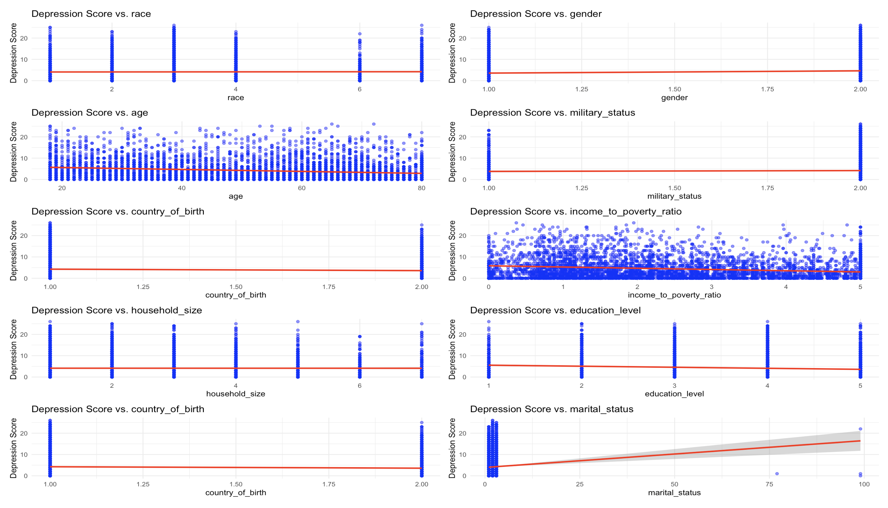
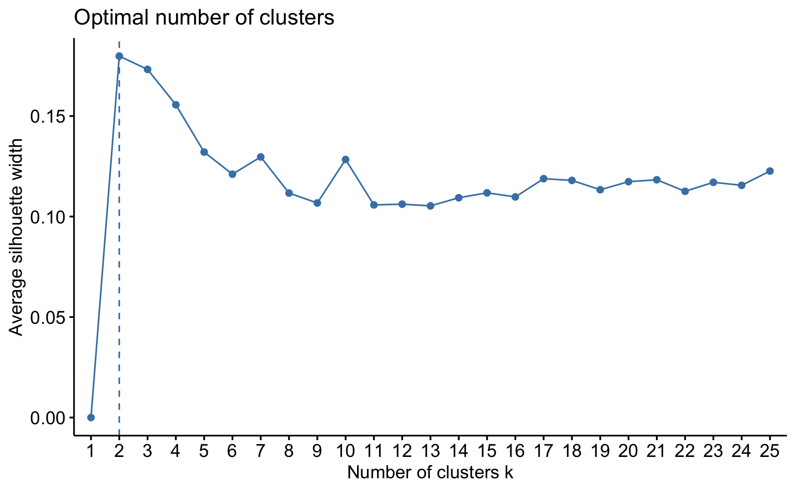
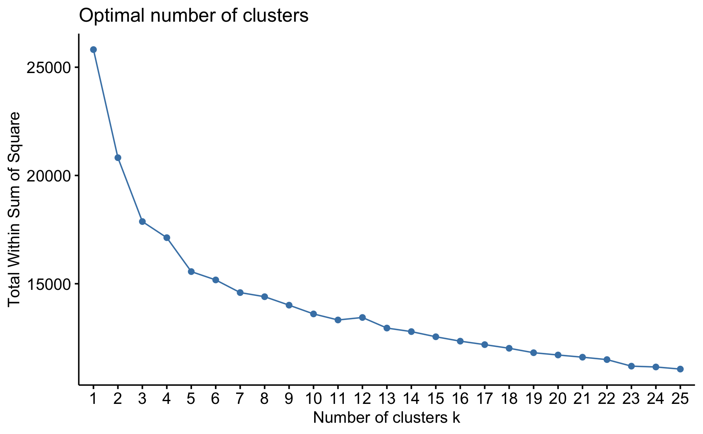
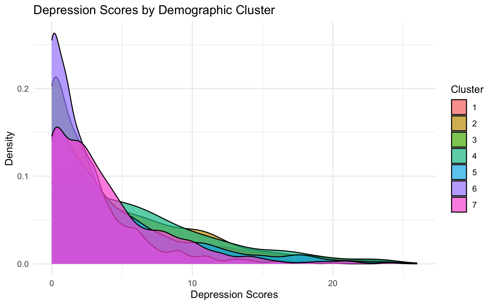
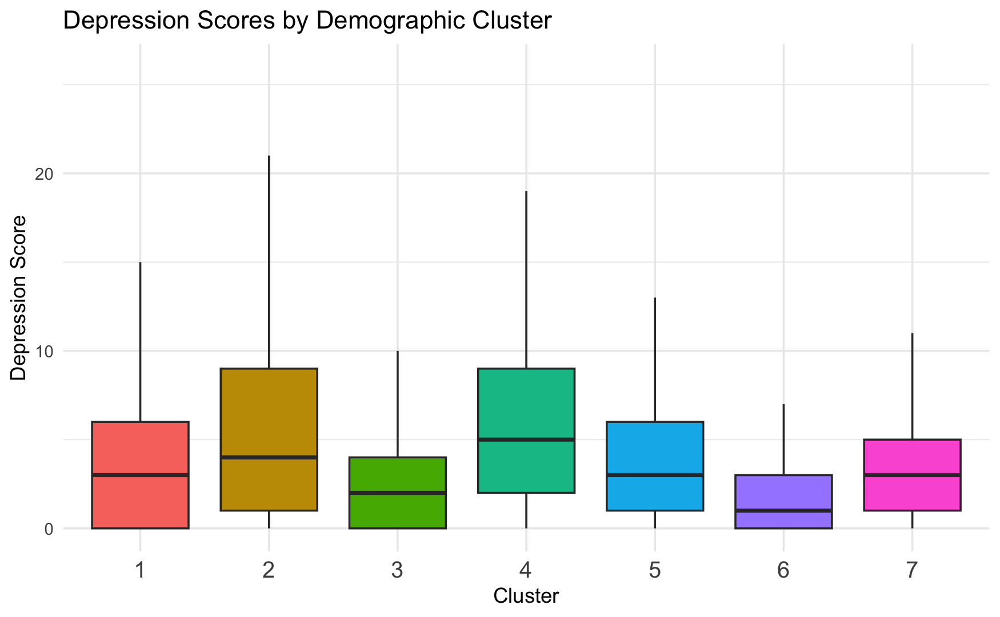
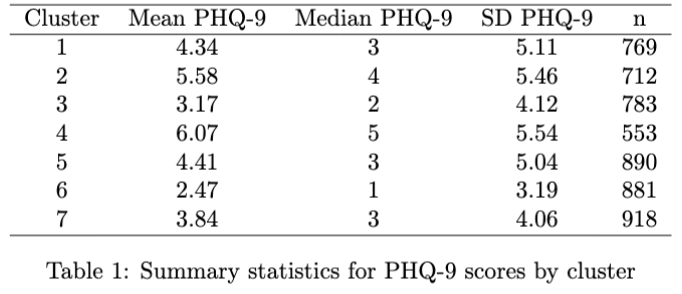
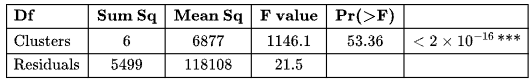

# Socioeconomic Disparities in Mental Health

<iframe src="assets/mental_health.jpg" width=800 height=600 frameBorder=0></iframe>

## Contents 
I. Introduction \
II. Objectives \
III. Methods* \
IV. Results \
V. Conclusion \
VI. References \
*All code notebooks can be found the in analysis_nbs folder within this repository.

## I. Introduction

### A. Background
Socioeconomic disparities have played as significant factors in individuals and communities’ wellness.  Factors such as race, gender, age, levels of education , marriage status, income, geographic location, and income could all be parts of very critical to one’s mental health. However, the resources are not equally distributed among everyone, individual’s can face barriers and limit access to helpful resources due to socioeconomic disparities.
Although that mental health disorder can happen to anyone regardless of their socioeconomic background, those who have lower socioeconomic background may have a higher chance of mental illness. In addition, socioeconomic disparities and systemic inequalities may cause limited resources for mental health care, social support, and the proper help one might need.

### B. Dataset

We are using data from the National Health and Nutrition Examination Survey (NHANES) for the years 2021-2023. This dataset provides us an overview of different demographic factors such as income, education, and household sizes and the PAtient Health Questionnaire responses(PHQ-9).

## II. Objectives
1. Analyze the impact of socioeconomic factors on mental health.
2. Identify key predictors of mental health disorders.
3. Enhance awareness and advocate for equitable mental health resourcees. 

## III. Methods

### A. Data Wrangling
1. Loading & Integrating Data
- Imported ‘depression questionnaire’ and ‘demographics’ datasets using read_xpt().
- Combined the two datasets by matching records through the ‘SEQN' identifier.

2. Addressing Missing Data  
- Implemented Multiple Imputation by Chained Equations (MICE) with predictive mean matching (pmm) to estimate missing values.
- Created five imputed datasets and opted for the first dataset for all analyses.

3. Constructing the PHQ-9 Depression Score
- Clinically validated measure used to assess the severity of depression with higher scores indicating more severe depressive symptoms. 
- Identified PHQ-9 questionnaire items (‘DPQ010’ to ‘DPQ090’).
- Converted values 7 (refused) and 9 (missing) to NA for accurate processing.
- Computed PHQ-9 Total Score by summing all valid responses while ignoring NA values.

All analysis was done in R and Python. Packages used includes scikit-learn, ggplot2, and plotly. All the code is provided within a folder in this repository.

## IV. Results

In our analysis, we focused on several key variables that will play a crucial role in shaping our models. Let’s take a closer look at some impactful visualizations that illustrate the relationships between socioeconomic factors and PHQ-9 scores.

### A. Data Visualizations

#### 1. Average Total PHQ-9 Scores by Race and Birth Country

<iframe src="assets/barplot.html" width=800 height=600 frameBorder=0></iframe>

The horizontal stacked bar plot depicts race on the y-axis and total PHQ-9 scores on the x-axis, color-coded by whether individuals were born in the U.S. or elsewhere. The findings indicate that individuals born in the U.S. tend to report higher depression scores than those born outside the country, regardless of age. Notably, Hispanic and Mexican participants exhibit the highest average PHQ-9 scores, highlighting potential challenges faced within these demographic groups.

#### 2. Total PHQ-9 Scores by Marital and Military Status

<iframe src="assets/boxplot.html" width=800 height=600 frameBorder=0></iframe>

This visualization sheds light on the intersection of marital and military status with mental health. The data shows that individuals who have never married and have not served in the military report the highest median PHQ-9 scores. Conversely, married individuals present the lowest scores and exhibit less variability, indicating the stabilizing effect of marital support. Interestingly, those who have not served in the military tend to have higher depression scores, raising important questions about the impact of military experiences on mental health.

#### 3. Average PHQ-9 Scores Based on Education Level and Gender

<iframe src="assets/funnel_plot.html" width=800 height=600 frameBorder=0></iframe>

The funnel plot demonstrates how education level and gender relate to PHQ-9 scores. It reveals a consistent trend: women tend to report higher depression scores than men across all education levels. Additionally, there’s a clear decrease in PHQ-9 scores with increased educational attainment, emphasizing the significant role that education can play in promoting mental well-being.

#### 4. Total PHQ-9 Score Analysis by Age Group, Income Level, and Household Size

<iframe src="assets/subplot_box.html" width=800 height=600 frameBorder=0></iframe>

Finally, we have three box plots depicting PHQ-9 scores across age groups, income-to-poverty ratios, and household sizes. The results indicate a linear decline in PHQ-9 scores with increasing age and income levels, with some exceptions observed among those with particularly high income-to-poverty ratios. While the relationship between household size and depression scores is less pronounced, data indicates that individuals living in households of two or six members report the lowest PHQ-9 scores.

### B. Modeling

#### 1. Regression Model

**Methods** 

To analyze the relationship between various demographic and socioeconomic factors with depression scores, we used a simple linear regression as our model. We first prepared the dataset by renaming the variables name for clarification and convert the categorical variables into factors. Then we run the linear regression models in a loop, evaluating each variable as a predictor to see their impact on the depression score.

**Results**
1. Race
- Non-Hispanic Asians tend to have a significantly lower depression score compared to the baseline (Mexican American).  

2. Month of Survey
- No significant effect on depression scores.  

3. Gender
- Females have a significantly higher depression score compared to males.  

4. Age
- Age has a negative correlation with depression score. For each additional year of age, the depression score decreases by **-0.0456**.  

5. Military Status
- No statistically significant correlation with depression (**p = 0.0913**), but those who responded "No" to military service tend to have slightly lower depression scores.  

6. Country of Birth
- Individuals born outside the U.S. tend to have lower depression scores.  

7. Education Level
- Individuals with higher education (college graduate or above) have significantly lower depression scores compared to those with lower education levels.  

8. Marital Status
- Those who are widowed/divorced/separated tend to have higher depression scores compared to the baseline (married/live with partner). 
- Never-married individuals have the highest increase in depression scores among all marital groups.  

9. Household Size
- No significant effect on depression scores.  

10. Income-to-Poverty Ratio
- A higher income-to-poverty ratio is statistically associated with **lower depression scores**. As income-to-poverty ratio increases, depression scores decrease.  

 

**Conclusion**
Based on our linear model results, we conclude that the factors with the **strongest influence** on depression scores are:
- **Gender** (higher depression in females)
- **Age** (negative effect)
- **Marital status** (widowed/divorced/separated & never married increase depression scores)
- **Education level** (higher education lowers depression scores)
- **Income-to-poverty ratio** (higher income lowers depression scores)

However, **race, month of survey, military status, and household size** have **little or no effect** on depression scores.

#### 2. Random Forest Regressor

**What is a Random Forest Regressor?** 
Imagine a forest full of decision trees, each contributing its own prediction. The Random Forest Regressor is an ensemble method that creates a "forest" of decision trees, and by averaging their predictions, it reduces errors and prevents overfitting. It’s very useful for handling complex, non-linear relationships, making it perfect for regression tasks like ours!

**Why Random Forest?** 

In the search to uncover the hidden drivers of mental health disparities, a good option seemed to be to use the Random Forest Regressor to predict depression scores (PHQ-9) based on socioeconomic factors. What makes this method special? It helps us explore complex relationships between factors like race, age, education, income, and household size—all of which may play a significant role in determining an individual's mental health.

**Methods: Building the Model**
A variety of socioeconomic factors was used to predict the total PHQ-9 score:

- **Race**
- **Exam Month** 
- **Age** 
- **Military Status**
- **Birth Country** 
- **Education Level**
- **Marital Status**
- **HouseholdSize**
- **Income Poverty Ratio**

After cleaning and preprocessing the data, one-hot encoding was applied to categorical variables to make them compatible with the Random Forest model. Then, the data was split into 80% training and 20% testing.

Lastly, GridSearchCV was used to optimize the hyperparameters, ensuring the best performance possible.

**Results: How Did It Perform?** 

Initial Model (Before One-Hot Encoding):
- MSE: 23.62
- R²: -0.04 (Not great — this model needed work!)

After One-Hot Encoding:
- MSE: 23.35
- R²: -0.028 (Slight improvement, but still not quite there.)

After Hyperparameter Tuning:

Best Parameters:

- {'max_depth': 10, 'min_samples_leaf': 4, 'min_samples_split': 10, 'n_estimators': 200}
- Best Cross-Validation MSE: 21.36
- Test Set MSE: 21.47
- Test Set R²: 0.055 (Still room for improvement, but the model is definitely getting closer!)
  
Despite the improvements, the model wasn't perfect, but the hyperparameter tuning helped refine its accuracy, providing us with more reliable predictions.

An MSE of 21.47 means that, on average, the model's predictions are off by about 21.47 units squared from the actual values. The R-squared value of 0.055 suggests that only 5.5% of the variability in the depression scores can be explained by the RF Regressor model.

The plots below visualize some of the model results and metrics.

<iframe src="assets/fig_actual_vs_predicted.html" width=800 height=600 frameBorder=0></iframe>

As we can see, the relationship between the actual and predicted PHQ9 scores aren't quite falling on the y = x line, meaning that they do not match up as well (this makes sense given the MSE and R-squared values of the model).

<iframe src="assets/fig_residuals.html" width=800 height=600 frameBorder=0></iframe>
A residuals plot shows the difference between the model's predicted values and the actual observed values, a.k.a. residuals. A positive residual (above the y = 0 line) indicates that the model's prediction was too low, meaning the actual value was higher than predicted. A negative residual (below the y = 0 line) means the model over-predicted, and the actual value was lower than the prediction. Ideally, the residuals should be randomly scattered around the horizontal line at y = 0, indicating that the model is unbiased and accurately capturing the data's patterns - with this specific model, the scattering of residuals is fairly decent, suggesting that the model is performing reasonably well but still has room for improvement.

<iframe src="assets/fig_importance.html" width=800 height=600 frameBorder=0></iframe>

**Key Features Driving Depression Scores** 

So, what factors are most important in predicting depression scores? According to the model, the top influencers are:
- Income Poverty Ratio
- Age
- Household Size
- Education Level

These socioeconomic factors are crucial in understanding mental health outcomes, and the model's feature importance revealed just how significant they are in predicting depression.

**Conclusion** 

The Random Forest Regressor provided valuable insights into mental health disparities, particularly the role of socioeconomic factors like income and age. While the model is still a work in progress, it highlights the key variables influencing depression scores and lays the groundwork for further exploration and improvement. 

#### 3. Clustering
**Goal**
Cluster the data based on demographic features and test for differences between PHQ-9 Scores between the clusters. 

**Method**
K-means clustering was used with 7 clusters 
	Number of clusters was chosen based on scree plot as well as silhouette plot
*Selecting number of centroids*
**Silhouette plot:**

Average silhouette width is an indicator of how well clusters are defined, with a higher silhouette score being associated with better clustering. 

**Scree Plot:**

Total Within Sum of Squares refers to the sum of squared error within a cluster, meaning that the lower the total sum of squares the tighter the cluster is.

Though the silhouette plot indicates that 2 clusters would be ideal, the within sum of squares for 2 clusters is very high as demonstrated on the scree plot. Therefore, 7 was chosen as the number of clusters for analysis due to decreased within sum of squares and having an average silhouette score for this dataset. 

**Results**

The size of the clusters are somewhat similar, ranging from 712 to 918. From both the boxplot and the plotted distributions, we can see that the PHQ-9 scores vary somewhat between the clusters. 
The mean PHQ-9 score ranges from 2.47 to 6.07, and the cluster with the smallest standard deviation is cluster 6. In an anova comparing the means of every cluster, there is evidence that the mean PHQ-9 score for at least one group is significantly different from the others.
 

**Further results**
Using these clusters, further analysis can be performed to determine the demographic factors that were the most important in deriving the clustering boundaries. 

#### 4. **eXtreme Gradient Boosting (XGBoost)**

**What is XGBoost?**

1. Machine learning algorithm designed for structured data.  
2. It improves prediction accuracy by sequentially boosting weak models while reducing errors.

**How It Works:**

1. Builds decision trees sequentially
2. Each tree corrects errors from the previous one
3. Uses gradient boosting to optimize predictions

**Why XGBoost?**
1. Handles Complex Interactions Between SES Factors
- Mental health is influenced by multiple SES factors (e.g., income, education, household size).
- XGBoost captures nonlinear relationships & interactions better than traditional regression models.
  	- The impact of education on depression might depend on income level, and XGBoost can learn these dependencies on its own.

2. Feature Importance and Interpretability
- Ranks features by importance, showing which SES factors are most predictive of depression (PHQ-9 scores).
- Helps identify key factors driving mental health disparities.

3. Good at Handling Large, Imbalanced Datasets
- NHANES has imbalanced data (e.g., more people with low PHQ-9 scores than high).
- XGBoost has built-in handling for class imbalance, improving predictions across different groups.
- Confirms accurate predictions across different SES groups, even if some are underrepresented.
  

**Code Breakdown**
1. Defining Predictors
- Selected 10 SES features for predicting PHQ-9 scores.

2. Split Data Into Training & Testing Sets
- 80% training, 20% testing for model evaluation.

3. Convert Data for XGBoost
- XGBoost requires numeric matrix format.
- Target variable: PHQ-9 score (Depression severity).

4. Train XGBoost Model
- 100 boosting rounds, learning rate = 0.1, max tree depth = 6 levels.

5. Evaluate Model Performance
- RMSE (Root Mean Squared Error): Measures prediction accuracy.
- R-squared: Shows how well SES factors explain depression variability.

6. Feature Importance Analysis
- Identifies key predictors affecting PHQ-9 scores.

<iframe src="assets/Actual_vs_Predicted_PHQ9.html" width=800 height=600 frameBorder=0></iframe>

<iframe src="assets/xgboost.html" width=800 height=600 frameBorder=0></iframe>

**RMSE: 4.68** 
- Avergage deviation between the model's predicted values and actual values.

**R-squared: 0.079**
- 7.9% of the variance in the dependent variab les (PHQ-9 score) is explained by the independent variables in the model. 
## V. Conclusion

Understanding the intersection of socioeconomic factors and mental health is crucial for addressing the disparities faced by millions. Our project sheds light on how various demographic factors contribute to depression rates, utilizing real-world data from NHANES. Through our analyses, we have highlighted the pressing need for enhanced mental health care resources and raised public awareness about these issues.

Our findings indicate that significant predictors of depression scores include gender, age, marital status, education level, and income-to-poverty ratio. Specifically, higher depression scores were found among females, younger individuals, and those who are widowed, divorced, or never married, while higher education and income correlated with lower scores. The clustering analysis revealed notable differences in PHQ-9 scores among various demographic groups, underscoring the need for targeted mental health interventions.

However, we must acknowledge several limitations in our study. Both the Random Forest and the XGBoost models demonstrated low explanatory power, with R-squared values of 0.055 and 0.079, respectively. This suggests that other factors likely influence depression scores beyond the socioeconomic variables we analyzed. Additionally, our reliance on cross-sectional data from NHANES may limit the ability to draw causal inferences. Potential confounding variables and the imputation of missing data could introduce bias, further complicating our findings. Lastly, the generalizability of our results may be restricted to the population sampled. Crucial future steps could include further research that includes a broader range of variables and diverse populations.

In conclusion, our insights contribute to the understanding of mental health disparities and serve as a foundation for prioritizing support for vulnerable groups. By advocating for policies and informing interventions that address these critical disparities, we can work toward improved mental health outcomes for all individuals.

## VI. References
1. National Health and Nutrition Examination Survey (NHANES). (2021-2023). [Dataset source description].
2. R Core Team (2021). R: A language and environment for statistical computing. R Foundation for Statistical Computing.
3. Breiman, L. (2001). Random Forests. Machine Learning, 45(1), 5-32.
4. Chen, T., & Guestrin, C. (2016). XGBoost: A Scalable Tree Boosting System. In Proceedings of the 22nd ACM SIGKDD International Conference on Knowledge Discovery and Data Mining (pp. 785-794).

